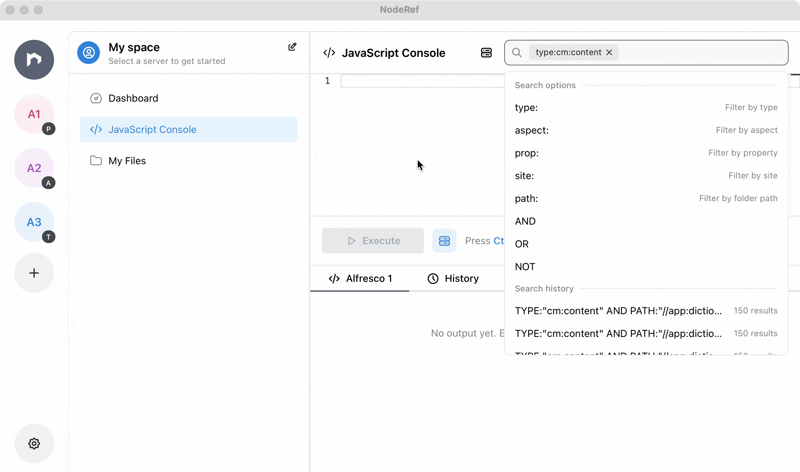

<div align="center">
<p>
  
  

  <h3>
    <b>
    Everything you do in Alfresco, now faster on desktop
    </b>
  </h3>

</p>

  <p>
    <sub>
      Built with ❤︎ by our
      <a href="../../graphs/contributors">
        contributors
      </a>
    </sub>
  </p>

<p>
  <a href="../../actions/workflows/release.yml">
    
  </a>
  <a href="./LICENSE">
    
  </a>
  <a href="../../issues">
    
  </a>
</p>

<p>
  
  
  
  
  
</p>

<figure style="width:100%; margin:0;">
  
</figure>

</div>

### **Features**

One clean desktop space to manage, debug, and explore Alfresco.

- 🗂 **Activity overview**  
  Stay oriented with a dashboard heatmap and timeline of recent nodes so jumping back into ongoing work is instant.

- 🔎 **Query builder**  
  Build complex searches across properties, aspects, types, paths, or sites without memorizing query strings.

- 💾 **Saved & recent searches**  
  Store favorite queries with custom result columns, reuse them across servers, and rerun anything from history in one click.

- 🖥 **Multi-server workspace**  
  Connect prod, test, and dev simultaneously, label each server clearly, jump into admin tools, and review logs from a single desktop window.

- 🧑‍💻 **Powerful JavaScript console**  
  Run scripts against one or many servers with execution history, Monaco editor, Alfresco-specific helpers, and optional `/ai` assistance when needed.

- 📑 **Tabbed node browser**  
  Open multiple nodes side-by-side, follow references, compare structures, and debug without losing your place.

- 📝 **File viewer & editor**  
  Inspect and edit JavaScript or other text-based content directly from the repository browser without leaving NodeRef.

- 🌳 **System tree insight**  
  Browse users, groups, permissions, and remote credentials per server using a clear, searchable tree.

- 🎛 **Workspace personalization**  
  Switch themes or languages, organize personal scripts and text files, and use the `Cmd+K` command palette to stay fast.

- 🔐 **Secure credentials**  
  Credentials remain encrypted with AES-256-GCM and a master key that never lives inside the database.

### **Who benefits?**

- **Alfresco admins** – browse repository data, review permissions, and run fast searches.
- **Alfresco developers** – iterate on scripts, inspect node structures, and debug quickly.
- **Support engineers** – connect to multiple client environments.

### **Prerequisites**

Before running NodeRef, make sure both your workstation and target Alfresco servers have the basics covered:

#### Local workstation

- Node.js LTS (v18+ recommended) with `corepack enable` so `pnpm` is available.
- `pnpm` 8+ for running workspace commands.
- Neutralino CLI binaries (downloaded automatically through `npx @neutralinojs/neu` when you run the scripts).

#### Optional for packaging

- `jq` plus any platform-specific tooling listed in [Packaging & installers](#packaging--installers) if you plan to produce DMG/MSI/DEB artifacts.

#### Alfresco servers

- The [OOTBee Support Tools](https://github.com/OrderOfTheBee/ootbee-support-tools) module installed so the JavaScript console and related APIs are available.

### **Quick start**

Spin up the full desktop environment in minutes with just two commands:

```bash
# 1. Install dependencies and download Neutralino binaries
pnpm install:all

# 2. Start desktop dev mode (Neutralino window + Chrome)
pnpm dev:app
```

Desktop dev mode opens:

- A **Chrome** window at `http://127.0.0.1:3000` with full DevTools
- A **Neutralino** window that mirrors how the production app behaves

### **Docker**

When network policies prevent the desktop app from reaching your Alfresco servers, deploy NodeRef directly inside your infrastructure. Test the image locally:

```bash
docker run -p 5111:5111 ghcr.io/noderef/noderef:latest
```

Then open [http://localhost:5111](http://localhost:5111) — data persists inside the container at `/data`.

### **Tech stack**

NodeRef relies on TypeScript/Neutralino stack:

- **Desktop framework:** [Neutralino.js](https://github.com/neutralinojs/neutralinojs)
- **Frontend:** [React](https://github.com/facebook/react), [Vite](https://github.com/vitejs/vite), [Mantine UI](https://github.com/mantinedev/mantine), [Monaco Editor](https://github.com/microsoft/monaco-editor)
- **Backend:** [Node.js](https://github.com/nodejs/node) HTTP server
- **Database:** [SQLite](https://github.com/sqlite/sqlite) powered by [Prisma](https://github.com/prisma/prisma) ORM
- **Language:** [TypeScript](https://github.com/microsoft/TypeScript) end-to-end
- **Package manager:** [`pnpm`](https://github.com/pnpm/pnpm) monorepo workspace

### **Database & storage**

Default paths depend on the runtime target:

- **Development:** `./dev.db` database and `./.runtime/master.key`
- **Desktop app:** `{appData}/NodeRef/dev.db` and `{appData}/NodeRef/.runtime/master.key`
- **Docker:** `/data/dev.db` and `/data/.runtime/master.key` (configure `DATA_DIR=/data`)

Override the database location with the `DATABASE_URL` environment variable when needed.

### **Credentials encryption**

Sensitive fields (passwords, API tokens) are encrypted with **AES-256-GCM**. A 32-byte master key is generated on first run and stored in `{dataDir}/.runtime/master.key`.

### **Development**

Everything runs inside a pnpm powered monorepo, so frontend, backend, and shared contracts evolve together. Use the layout overview and command palette below to navigate the workspace.

#### Workspace layout

```
noderef/
├── apps/
│   ├── renderer/      # React frontend
│   └── backend/       # Node.js backend
├── packages/
│   └── contracts/     # Shared TS models & RPC contracts
├── resources/         # Built frontend (generated)
└── resources/node-src/dist/  # Built backend (generated)
```

#### Commands

| Command                 | Description                                                                   |
| ----------------------- | ----------------------------------------------------------------------------- |
| `pnpm install:all`      | Install dependencies, fetch Neutralino binaries, and sync metadata            |
| `pnpm dev:app`          | Full desktop dev loop (renderer + backend + Neutralino shell)                 |
| `pnpm dev:browser`      | Browser-only dev loop (renderer + backend, no Neutralino window)              |
| `pnpm dev:renderer`     | Run the renderer only (Vite dev server)                                       |
| `pnpm dev:backend`      | Run the backend only with nodemon                                             |
| `pnpm migrate:dev`      | Run Prisma migrations against the local SQLite DB                             |
| `pnpm build:installers` | Build macOS, Windows, and Linux installers via Neutralino + packaging scripts |
| `pnpm package[:target]` | Produce ready-to-ship bundles (`:mac`, `:win`, `:linux` targets available)    |
| `pnpm docker:run`       | Build the Docker image and launch the compose stack for NodeRef               |
| `pnpm lint`             | Run ESLint                                                                    |
| `pnpm format`           | Apply Prettier formatting                                                     |
| `pnpm format:check`     | Verify formatting without writing changes                                     |
| `pnpm purge`            | Clean build outputs, generated files, and local dev databases                 |
| `pnpm release`          | Execute the scripted release pipeline                                         |

> Tip: VS Code tasks (`Terminal → Run Task…`) mirror these scripts, so you can launch `dev:app`, `build:installers`, `docker:run`, and more without remembering the commands. Check `.vscode/tasks.json` for the curated list.

#### Migrations & prisma

- Prisma schema lives in `apps/backend/prisma/schema.prisma`.
- Migrations are stored in `apps/backend/prisma/migrations`.
- After editing the schema or applying migrations:

  ```bash
  pnpm --filter @app/backend prisma:generate
  ```

### **Packaging & installers**

Ship binaries for every platform. The workflow below covers raw Neutralino builds, installer generation, and quick verification for macOS, Windows, and Linux.

<p align="left">
  
  
  
</p>

#### Build platform binaries

```bash
npx neu build --release
```

The backend compiles to `resources/node-src/dist/server.js` and this command produces fresh binaries for each OS before packaging.

#### Platform outputs

- 🍎 **macOS:** `noderef-mac_x64`, `noderef-mac_arm64`, `noderef-mac_universal`
- 🪟 **Windows:** `noderef-win_x64.exe` (and MSI installers: `dist/noderef-win_x64.msi`)
- 🐧 **Linux / Ubuntu:** `noderef-linux_x64`, `noderef-linux_arm64`, `noderef-linux_armhf`
- 📦 **Resources bundle:** `resources.neu`

#### Build installers

1. Install `jq` (`brew install jq` on macOS, `apt-get install jq` on Ubuntu/Debian).
2. Run the packaging workflow:

   ```bash
   pnpm build:installers
   ```

   This script:
   1. Ensures `build-scripts/` is present (auto-cloning and pinning when needed).
   2. Recreates `_app_scaffolds` and copies icons into the proper Neutralino resource folders.
   3. Builds contracts, renderer, and backend artefacts.
   4. Invokes `neu build --release` for each platform and assembles package outputs in `dist/`.

#### Quick testing

```bash
./dist/noderef-mac_arm64         # macOS preview
./dist/noderef-linux_x64         # Linux preview
./dist/noderef-win_x64.exe       # Windows preview
```

## License

NodeRef is licensed under the **Apache License 2.0**.

You may obtain a copy at [`LICENSE`](./LICENSE) or <http://www.apache.org/licenses/LICENSE-2.0>.
