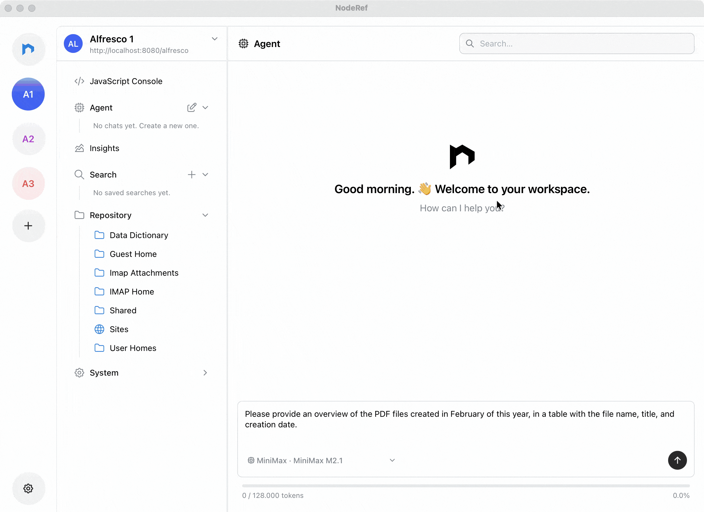

<div align="center">
<p>
  
  

  <h3>Desktop workspace for Alfresco</h3>

</p>

  <p>
    <sub>
      Built with ❤︎ by our
      <a href="../../graphs/contributors">
        contributors
      </a>
    </sub>
  </p>

<p>
  <a href="../../actions/workflows/release.yml">
    
  </a>
  <a href="./LICENSE">
    
  </a>
  <a href="../../issues">
    
  </a>
</p>

<p>
  
  
  
  
  
</p>

<figure style="width:100%; margin:0;">
  
</figure>

</div>

NodeRef gives Alfresco teams a focused desktop workspace for searching repositories, inspecting nodes, running scripts, and working across environments without bouncing between multiple admin tools.

### ✨ **Features**

- **Activity overview** — Dashboard heatmap and timeline of recent nodes.
- **Query builder** — Search by property, aspect, type, path, or site. No CMIS/AFTS syntax required.
- **Saved searches** — Store queries with custom result columns, reuse across servers.
- **JavaScript console** — Execute scripts across servers, view history, and `/ai` assist.
- **Agent chat** — Ask your repo in plain English. Search nodes, run scripts, or change permissions by describing what you need.
- **Privacy masking** — Mask sensitive properties/text before prompts are sent to the configured AI provider.
- **Multi-server workspace** — Connect prod, test, and dev environments simultaneously.
- **Tabbed node browser** — Open nodes side-by-side, follow references, compare structures.
- **File viewer & editor** — Edit JS or text content directly from the repository.
- **System tree** — Browse users, groups, permissions, and credentials per server.
- **Personalization** — Themes, languages, personal scripts, `Cmd+K` command palette.
- **Credentials encryption** — AES-256-GCM; master key stored outside the database.

Built for Alfresco admins, developers, and support engineers who need faster diagnostics, safer operational workflows, and fewer context switches.

### 📋 **Prerequisites**

Before running NodeRef from source, make sure both your workstation and target Alfresco servers have the basics covered:

#### Local workstation

- Node.js LTS (v18+ recommended) with `corepack enable` so `pnpm` is available.
- `pnpm` 8+ for running workspace commands.
- Neutralino CLI binaries (downloaded automatically through `npx @neutralinojs/neu` when you run the scripts).

#### Optional for packaging

- `jq` plus any platform-specific tooling listed in [Packaging & installers](#packaging--installers) if you plan to produce DMG/MSI/DEB artifacts.

#### Alfresco servers

- Designed around Alfresco public APIs, with broad compatibility across Alfresco 5.x and newer installations. Some features may vary by server version and module availability.
- The [OOTBee Support Tools](https://github.com/OrderOfTheBee/ootbee-support-tools) module installed so the JavaScript console and related APIs are available.

### 🚀 **Quick start**

For local development or evaluation from source:

```bash
# 1. Install dependencies and download Neutralino binaries
pnpm install:all

# 2. Start desktop dev mode (Neutralino window + Chrome)
pnpm dev:app
```

Desktop dev mode opens:

- A **Chrome** window at `http://127.0.0.1:3000` with full DevTools
- A **Neutralino** window that mirrors how the production app behaves

If you prefer to run NodeRef inside your infrastructure instead of a local desktop shell, see [Docker](#-docker).

### 🐳 **Docker**

Deploy inside your infrastructure when network policies block the desktop app or when teams prefer a browser-based rollout:

```bash
docker run -p 5111:5111 ghcr.io/noderef/noderef:latest
```

Then open [http://localhost:5111](http://localhost:5111) — data persists inside the container at `/data`.

### 🛠 **Tech stack**

- **Desktop framework:** [Neutralino.js](https://github.com/neutralinojs/neutralinojs)
- **Frontend:** [React](https://github.com/facebook/react), [Vite](https://github.com/vitejs/vite), [Mantine UI](https://github.com/mantinedev/mantine), [Monaco Editor](https://github.com/microsoft/monaco-editor)
- **Backend:** [Node.js](https://github.com/nodejs/node) HTTP server
- **Database:** [SQLite](https://github.com/sqlite/sqlite) powered by [Prisma](https://github.com/prisma/prisma) ORM
- **Language:** [TypeScript](https://github.com/microsoft/TypeScript) end-to-end
- **Package manager:** [`pnpm`](https://github.com/pnpm/pnpm) monorepo workspace

### 💾 **Database & storage**

Default paths depend on the runtime target:

- **Development:** `./dev.db` database and `./.runtime/master.key`
- **Desktop app:** `{appData}/NodeRef/dev.db` and `{appData}/NodeRef/.runtime/master.key`
- **Docker:** `/data/dev.db` and `/data/.runtime/master.key` (configure `DATA_DIR=/data`)

Override the database location with the `DATABASE_URL` environment variable when needed.

### 🔐 **Credentials encryption**

Sensitive fields (passwords, API tokens) are encrypted with **AES-256-GCM**. A 32-byte master key is generated on first run and stored in `{dataDir}/.runtime/master.key`, keeping secrets outside the SQLite database itself.

### 🔑 **OIDC / OpenID Connect authentication**

NodeRef supports OIDC authentication (e.g., Keycloak) for connecting to Alfresco servers, which helps teams align desktop access with existing enterprise identity flows. When configuring your identity provider:

#### Redirect URIs

Add these redirect URIs to your OIDC client configuration (NodeRef binds to ports 59001-59005):

```
http://127.0.0.1:59001/auth/callback
http://127.0.0.1:59002/auth/callback
http://127.0.0.1:59003/auth/callback
http://127.0.0.1:59004/auth/callback
http://127.0.0.1:59005/auth/callback
```

> **Note:** While [RFC8252](https://datatracker.ietf.org/doc/html/rfc8252#section-7.3) recommends that authorization servers allow any port for loopback redirect URIs, Keycloak does not currently support wildcard ports. You must register each port explicitly. See [#39880](https://github.com/keycloak/keycloak/issues/39880) for details.

#### Keycloak configuration

For Alfresco environments using Keycloak, the authorization server URL typically follows this pattern:

```
https://{alfresco-host}/auth
```

Replace `{alfresco-host}` with your Alfresco server's hostname or IP address.

### 💻 **Development**

pnpm monorepo with frontend, backend, and shared contracts.

#### Workspace layout

```
noderef/
├── apps/
│   ├── renderer/      # React frontend
│   └── backend/       # Node.js backend
├── packages/
│   └── contracts/     # Shared TS models & RPC contracts
├── resources/         # Built frontend (generated)
└── resources/node-src/dist/  # Built backend (generated)
```

#### Commands

| Command                 | Description                                                                   |
| ----------------------- | ----------------------------------------------------------------------------- |
| `pnpm install:all`      | Install dependencies, fetch Neutralino binaries, and sync metadata            |
| `pnpm dev:app`          | Full desktop dev loop (renderer + backend + Neutralino shell)                 |
| `pnpm dev:browser`      | Browser-only dev loop (renderer + backend, no Neutralino window)              |
| `pnpm dev:renderer`     | Run the renderer only (Vite dev server)                                       |
| `pnpm dev:backend`      | Run the backend only with nodemon                                             |
| `pnpm test`             | Run backend integration tests                                                 |
| `pnpm migrate:dev`      | Run Prisma migrations against the local SQLite DB                             |
| `pnpm build:installers` | Build macOS, Windows, and Linux installers via Neutralino + packaging scripts |
| `pnpm package[:target]` | Produce ready-to-ship bundles (`:mac`, `:win`, `:linux` targets available)    |
| `pnpm docker:run`       | Build the Docker image and launch the compose stack for NodeRef               |
| `pnpm lint`             | Run ESLint                                                                    |
| `pnpm format`           | Apply Prettier formatting                                                     |
| `pnpm format:check`     | Verify formatting without writing changes                                     |
| `pnpm purge`            | Clean build outputs, generated files, and local dev databases                 |
| `pnpm release`          | Execute the scripted release pipeline                                         |

> Tip: VS Code tasks (`Terminal → Run Task…`) mirror these scripts, so you can launch `dev:app`, `build:installers`, `docker:run`, and more without remembering the commands. Check `.vscode/tasks.json` for the curated list.

#### Migrations & prisma

- Prisma schema lives in `apps/backend/prisma/schema.prisma`.
- Migrations are stored in `apps/backend/prisma/migrations`.
- After editing the schema or applying migrations:

  ```bash
  pnpm --filter @app/backend prisma:generate
  ```

### 🧪 **Testing**

Integration tests cover RPC handlers and database operations:

```bash
pnpm test
```

Tests use an isolated `test.db` database.

### 📦 **Packaging & installers**

<p align="left">
  
  
  
</p>

#### Build platform binaries

```bash
npx neu build --release
```

The backend compiles to `resources/node-src/dist/server.js` and this command produces fresh binaries for each OS before packaging.

#### Platform outputs

- **macOS:** `noderef-mac_x64`, `noderef-mac_arm64`, `noderef-mac_universal`
- **Windows:** `noderef-win_x64.exe` (MSI: `dist/noderef-win_x64.msi`)
- **Linux:** `noderef-linux_x64`, `noderef-linux_arm64`, `noderef-linux_armhf`
- **Resources bundle:** `resources.neu`

#### Build installers

1. Install `jq` (`brew install jq` on macOS, `apt-get install jq` on Ubuntu/Debian).
2. Run the packaging workflow:

   ```bash
   pnpm build:installers
   ```

   This script:
   1. Ensures `build-scripts/` is present (auto-cloning and pinning when needed).
   2. Recreates `_app_scaffolds` and copies icons into the proper Neutralino resource folders.
   3. Builds contracts, renderer, and backend artefacts.
   4. Invokes `neu build --release` for each platform and assembles package outputs in `dist/`.

#### Quick testing

```bash
./dist/noderef-mac_arm64         # macOS preview
./dist/noderef-linux_x64         # Linux preview
./dist/noderef-win_x64.exe       # Windows preview
```

## 📝 Changelog

See [GitHub releases](https://github.com/noderef/noderef/releases) for version history.

## 📄 License

NodeRef is licensed under the **Apache License 2.0**.

You may obtain a copy at [`LICENSE`](./LICENSE) or <http://www.apache.org/licenses/LICENSE-2.0>.
