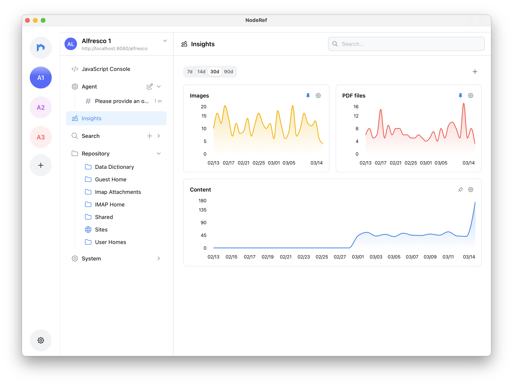

This release introduces **Insights** to NodeRef. 📈

Insights gives you a quick visual pulse of activity in your connected repositories with time series graphs for various queries you define. You can also **pin** graphs to keep the signals you care about on you dashboard, and fine-tune what’s shown via the graph settings. ✨

Alongside Insights, we shipped a set of quality and reliability improvements: fixed stale backend reconnection and loopback binding issues, improved the server selector label display, corrected missing Site roles in the permissions dropdown, and addressed QName mention suggestion gaps for custom models. We also tightened up Agent behavior (Trusted mode during in-progress runs), improved prompt context awareness with a temporal directive, and refreshed the search skill documentation. 🔧

