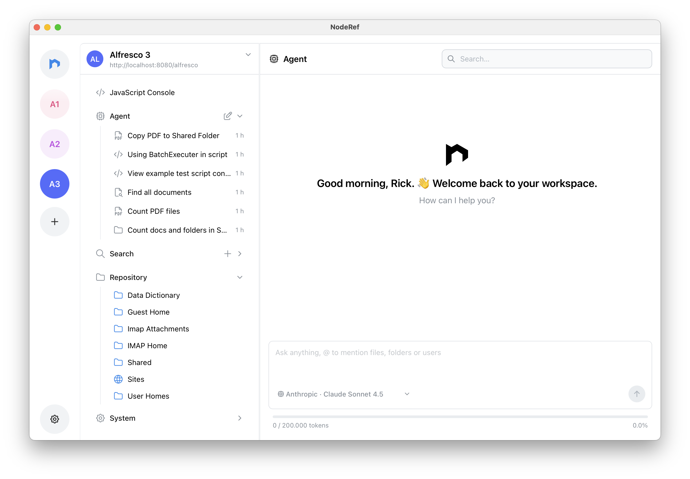

This release turns NodeRef into an **Agentic** desktop app. 🤖

We added full Agent chat capabilities with persistent conversations and real Alfresco repository tools for creating, copying, moving, and deleting nodes. We also expanded the Agent with text export/write actions, stronger script creation, and new skills for managing groups and users so the Agent can handle more real work end to end. 😎

You can also choose which models you want to use during the chats. We also improved the overall chat experience with chat search, better mention handling, QName mentions, and improved context window and auto approval flows to make longer sessions feel smoother. For safety, we introduced **privacy** controls 🔒 via masking settings and default masking prefixes to better prevent sensitive values from being sent to LLM providers. Last but not least, we included reliability and maintenance improvements across the app: fixes for manage permissions and DSL response parsing with repair logic.
