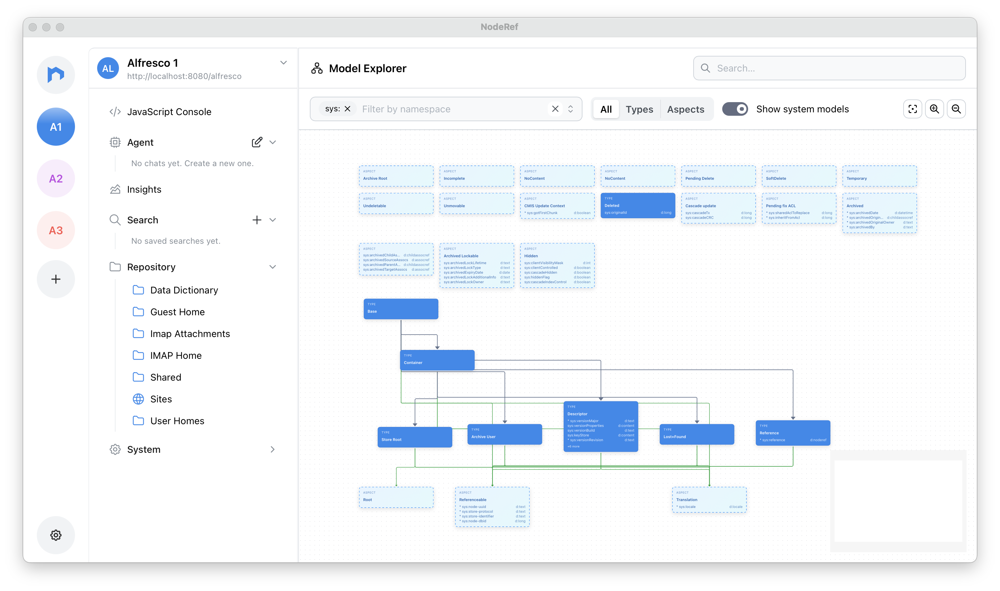

This release brings **a new way to update** the NodeRef app, a visual **Model Explorer**, and smarter **Agent** using Hyland documentation. 🚀

The new **Model Explorer** gives you an interactive map of your Alfresco content model.

Browse types and aspects, filter by namespace, and open the schema inspector to see properties, associations, constraints, and parent types.

For AI, you can now use **OpenRouter** as a provider alongside Anthropic and MiniMax, with a searchable model catalog so you can pick the model that fits your task. The Agent now also have Hyland documentation tools when you need answers from official Alfresco and Hyland docs without leaving NodeRef.

We also polished the experience along the way and added small UI tweaks.
